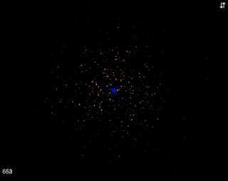

Gravity
======================

An experiment on [Processing.js](http://processingjs.org/), simulating universal gravitation in a simple fashion.

Uses parts of ES6, so might not work on all browsers (yet).

License: [MIT](LICENSE)

## Demo

Click on the GIF

